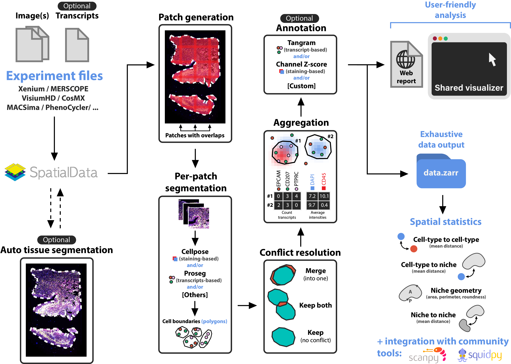

# Spatial-omics pipeline and analysis

  

Built on top of [SpatialData](https://github.com/scverse/spatialdata), Sopa enables processing and analyses of spatial omics data with single-cell resolution (spatial transcriptomics or multiplex imaging data) using a standard data structure and output. We currently support the following technologies: Xenium, Visium HD, MERSCOPE, CosMx, PhenoCycler, MACSima, Molecular Cartography, and others. Sopa was designed for generability and low memory consumption on large images (scales to `1TB+` images).

!!! info
    You may also be interested in [Novae](https://github.com/MICS-Lab/novae), developed by the same authors, now published in [Nature Methods](https://www.nature.com/articles/s41592-025-02899-6) 🎉

## Overview

The following illustration describes the main steps of `sopa`:

  

## Why use `sopa`

Sopa is a modern Python toolkit that is easy to use and offers many advantages:

- `sopa` is designed to be memory-efficient, and it scales to slides with millions of cells
- `sopa` can be used on any spatial technology with single-cell resolution, making it straightforward to apply it to multiple projects
- Many segmentation tools are implemented in Sopa, so you can try/compare them all easily
- Depending on your need, you can use our API, CLI, or directly the Snakemake pipeline
- You can visualize your data in an interactive manner
- Spatial operations are optimized and use `shapely` internally
- `sopa` integrates naturally with other community tools such as [Scanpy](https://scanpy.readthedocs.io/en/stable/index.html) or [Squidpy](https://squidpy.readthedocs.io/en/latest/index.html).

Start using Sopa by reading our [getting started](getting_started) guide!
