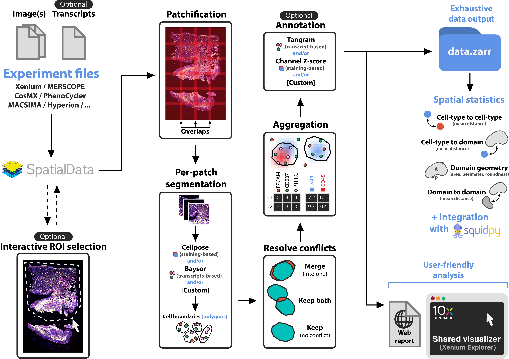

# Spatial-omics pipeline and analysis

  

Built on top of [SpatialData](https://github.com/scverse/spatialdata), Sopa enables processing and analyses of image-based spatial omics using a standard data structure and output. We currently support the following technologies: Xenium, MERSCOPE, CosMX, PhenoCycler, MACSIMA, Hyperion. Sopa was designed for generability and low memory consumption on large images (scales to `1TB+` images).

The pipeline outputs contain: (i) Xenium Explorer files for interactive visualization, (ii) an HTML report for quick quality controls, and (iii) a SpatialData `.zarr` directory for further analyses.

## Overview

The following illustration describes the main steps of `sopa`:

  

## Why use `sopa`

- `sopa` is designed to be memory-efficient, and it scales to large datasets with millions of cells
- Depending on your need, you can use our Snakemake pipeline, our CLI, or our API
- It's straightforward to move on to another spatial omics technology since `sopa` is general to every image-based spatial omics
- You can open any data with the [Xenium Explorer](https://www.10xgenomics.com/support/software/xenium-explorer), which is a user-friendly software with many functions
- Spatial statistics are optimized since geometric operations use `shapely` internally
- You can customize `sopa` and add your own segmentation or annotation tool if desired
- `sopa` integrates naturally with other community tools such as [Scanpy](https://scanpy.readthedocs.io/en/stable/index.html) or [Squidpy](https://squidpy.readthedocs.io/en/latest/index.html).
