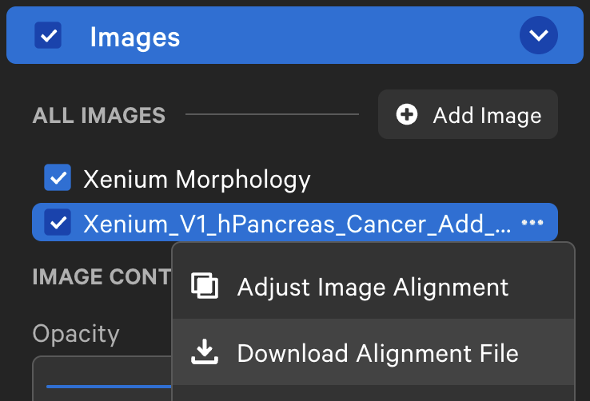
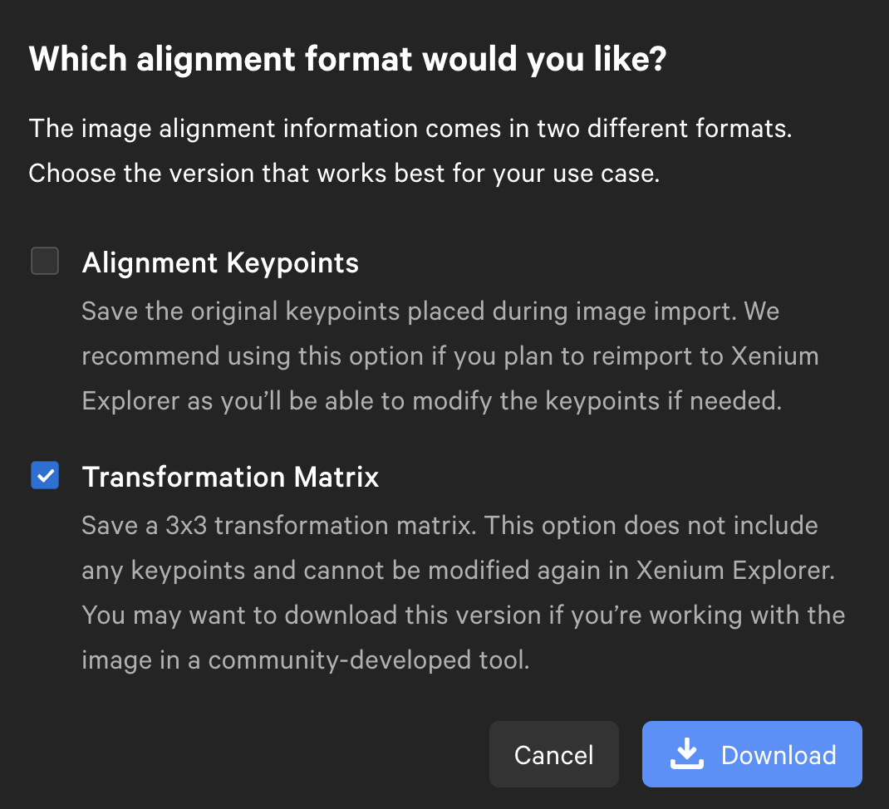

# Landmark-based alignment

You can align any omic layer by defining manual landmark annotations. This can either be done via the Xenium Explorer, or [`napari-spatialdata`](https://spatialdata.scverse.org/projects/napari/en/latest/index.html).

## Via the Xenium Explorer

You'll need two things for alignment with the Xenium Explorer:

- A `SpatialData` object (see [`sopa.io`](../../api/readers)) and it's corresponding Xenium Explorer directory (see next section).
- An image (usually `.tif` or `.ome.tif`) that you want to align to the `SpatialData` object.

> *Xenium Explorer* is a registered trademark of 10x Genomics. The Xenium Explorer is licensed for usage on Xenium data (more details [here](https://www.10xgenomics.com/legal/end-user-software-license-agreement)).

### Explorer data

If not done yet, convert your `SpatialData` object to the Xenium Explorer's inputs. This can be done as detailed in [this tutorial](../api_usage/#with-the-xenium-explorer). For instance:

```python
import spatialdata
import sopa

sdata = spatialdata.read_zarr("/path/to/your/data.zarr")

sopa.io.explorer.write("data.explorer", sdata)
```

This will create a `experiment.xenium` file under `data.explorer` that you'll use later to open the data in the Xenium Explorer.

### Image conversion

You need to have the right image format for the Xenium Explorer. Here, we convert the image you want to align to the right format.

!!! note "Xenium users"
    If using the Xenium machine, then you don't need conversion; the images provided by the Xenium machine already have the correct format.

You can convert the image with QuPath as written in this [10x genomics webpage](https://www.10xgenomics.com/support/software/xenium-explorer/tutorials/xe-image-file-conversion). Otherwise, if you are not familiar with QuPath, you can also use our API to write the image:
```python
# use sopa.io.ome_tif to read your image, or any reader from sopa.io, e.g. sopa.io.wsi
image = sopa.io.ome_tif("path/to/your/image.tif", as_image=True)

# write this image so that it can be open with the Xenium Explorer
sopa.io.explorer.write_image("my_image.ome.tif", image, is_dir=False)
```

### Keypoint placement

!!! warning
    Make sure your Xenium Explorer version is at least `1.3.0`

Double-click on the `experiment.xenium` file to open the Xenium Explorer, or select this file from the Xenium Explorer interface. It will display the data in the explorer.

On the Xenium Explorer, under the "Images" panel, click "Add image" and follow the instructions on the screen (you'll need to choose the image you created in the **previous section**).

<p align="center">
  
</p>

Afterwards, the explorer will automatically align the images based on the key points you selected on both images.

### Update your SpatialData object

After alignment, export the transformation matrix as a `.csv` file. For that, select your aligned image under the "Images" panel and click on "Download Alignment File":

<p align="center">
  
</p>

Then, select only the "Transformation Matrix" box and download it:

<p align="center">
  
</p>

Via the API, you can now update your `SpatialData` object as follows:
```python
# specify below the location of the matrix.csv file:
sopa.io.explorer.align(sdata, image, "image_test_matrix.csv")
```

Via the CLI, you'll need the path to the `.zarr` directory corresponding to your `SpatialData` object (`SDATA_PATH`), the path to the `.ome.tif` image that you converted above (`IMAGE_PATH`), and the `.csv` transformation matrix that you exported from the Xenium Explorer (`TRANSFORMATION_MATRIX_PATH`):

```sh
sopa explorer add-aligned <SDATA_PATH> <IMAGE_PATH> <TRANSFORMATION_MATRIX_PATH>
```

## Via napari-spatialdata

Intead of the Xenium Explorer, you can also use [`napari-spatialdata`](https://spatialdata.scverse.org/projects/napari/en/latest/index.html) to align images.

Refer to [this existing tutorial](https://spatialdata.scverse.org/en/latest/tutorials/notebooks/notebooks/examples/alignment_using_landmarks.html) for more details.
